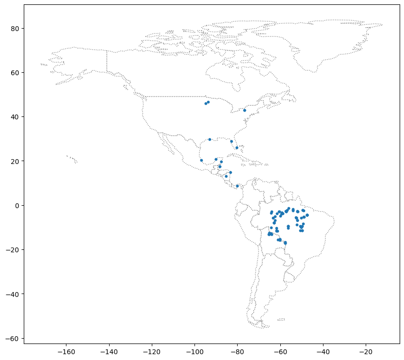

```python
# 패키지 설치
!pip install geopandas
```

    Looking in indexes: https://pypi.org/simple, https://us-python.pkg.dev/colab-wheels/public/simple/
    Requirement already satisfied: geopandas in /usr/local/lib/python3.10/dist-packages (0.13.0)
    Requirement already satisfied: fiona>=1.8.19 in /usr/local/lib/python3.10/dist-packages (from geopandas) (1.9.4)
    Requirement already satisfied: packaging in /usr/local/lib/python3.10/dist-packages (from geopandas) (23.1)
    Requirement already satisfied: pandas>=1.1.0 in /usr/local/lib/python3.10/dist-packages (from geopandas) (1.5.3)
    Requirement already satisfied: pyproj>=3.0.1 in /usr/local/lib/python3.10/dist-packages (from geopandas) (3.5.0)
    Requirement already satisfied: shapely>=1.7.1 in /usr/local/lib/python3.10/dist-packages (from geopandas) (2.0.1)
    Requirement already satisfied: attrs>=19.2.0 in /usr/local/lib/python3.10/dist-packages (from fiona>=1.8.19->geopandas) (23.1.0)
    Requirement already satisfied: certifi in /usr/local/lib/python3.10/dist-packages (from fiona>=1.8.19->geopandas) (2022.12.7)
    Requirement already satisfied: click~=8.0 in /usr/local/lib/python3.10/dist-packages (from fiona>=1.8.19->geopandas) (8.1.3)
    Requirement already satisfied: click-plugins>=1.0 in /usr/local/lib/python3.10/dist-packages (from fiona>=1.8.19->geopandas) (1.1.1)
    Requirement already satisfied: cligj>=0.5 in /usr/local/lib/python3.10/dist-packages (from fiona>=1.8.19->geopandas) (0.7.2)
    Requirement already satisfied: six in /usr/local/lib/python3.10/dist-packages (from fiona>=1.8.19->geopandas) (1.16.0)
    Requirement already satisfied: python-dateutil>=2.8.1 in /usr/local/lib/python3.10/dist-packages (from pandas>=1.1.0->geopandas) (2.8.2)
    Requirement already satisfied: pytz>=2020.1 in /usr/local/lib/python3.10/dist-packages (from pandas>=1.1.0->geopandas) (2022.7.1)
    Requirement already satisfied: numpy>=1.21.0 in /usr/local/lib/python3.10/dist-packages (from pandas>=1.1.0->geopandas) (1.22.4)
    


```python
import geopandas as gpd
```


```python
from google.colab import drive
drive.mount('/content/drive')
```

    Drive already mounted at /content/drive; to attempt to forcibly remount, call drive.mount("/content/drive", force_remount=True).
    


```python
# Load a GeoDataFrame containing regions in Ghana
regions = gpd.read_file("/content/drive/MyDrive/2023 데이터마이닝/archive/ghana/ghana/Regions/Map_of_Regions_in_Ghana.shp")
print(regions.crs)
```

    EPSG:32630
    


```python
import pandas as pd
# Create a DataFrame with health facilities in Ghana
facilities_df = pd.read_csv("/content/drive/MyDrive/2023 데이터마이닝/archive/ghana/ghana/health_facilities.csv")

# Convert the DataFrame to a GeoDataFrame
facilities = gpd.GeoDataFrame(facilities_df, geometry=gpd.points_from_xy(facilities_df.Longitude, facilities_df.Latitude))

# Set the coordinate reference system (CRS) to EPSG 4326
facilities.crs = {'init': 'epsg:4326'}

# View the first five rows of the GeoDataFrame
facilities.head()
```

    /usr/local/lib/python3.10/dist-packages/pyproj/crs/crs.py:141: FutureWarning: '+init=<authority>:<code>' syntax is deprecated. '<authority>:<code>' is the preferred initialization method. When making the change, be mindful of axis order changes: https://pyproj4.github.io/pyproj/stable/gotchas.html#axis-order-changes-in-proj-6
      in_crs_string = _prepare_from_proj_string(in_crs_string)
    


  <div id="df-90f64a8d-7fa8-4165-886e-1b2b6c83a999">
    <div class="colab-df-container">
      <div>
<style scoped>
    .dataframe tbody tr th:only-of-type {
        vertical-align: middle;
    }

    .dataframe tbody tr th {
        vertical-align: top;
    }

    .dataframe thead th {
        text-align: right;
    }
</style>
<table border="1" class="dataframe">
  <thead>
    <tr style="text-align: right;">
      <th></th>
      <th>Region</th>
      <th>District</th>
      <th>FacilityName</th>
      <th>Type</th>
      <th>Town</th>
      <th>Ownership</th>
      <th>Latitude</th>
      <th>Longitude</th>
      <th>geometry</th>
    </tr>
  </thead>
  <tbody>
    <tr>
      <th>0</th>
      <td>Ashanti</td>
      <td>Offinso North</td>
      <td>A.M.E Zion Clinic</td>
      <td>Clinic</td>
      <td>Afrancho</td>
      <td>CHAG</td>
      <td>7.40801</td>
      <td>-1.96317</td>
      <td>POINT (-1.96317 7.40801)</td>
    </tr>
    <tr>
      <th>1</th>
      <td>Ashanti</td>
      <td>Bekwai Municipal</td>
      <td>Abenkyiman Clinic</td>
      <td>Clinic</td>
      <td>Anwiankwanta</td>
      <td>Private</td>
      <td>6.46312</td>
      <td>-1.58592</td>
      <td>POINT (-1.58592 6.46312)</td>
    </tr>
    <tr>
      <th>2</th>
      <td>Ashanti</td>
      <td>Adansi North</td>
      <td>Aboabo Health Centre</td>
      <td>Health Centre</td>
      <td>Aboabo No 2</td>
      <td>Government</td>
      <td>6.22393</td>
      <td>-1.34982</td>
      <td>POINT (-1.34982 6.22393)</td>
    </tr>
    <tr>
      <th>3</th>
      <td>Ashanti</td>
      <td>Afigya-Kwabre</td>
      <td>Aboabogya Health Centre</td>
      <td>Health Centre</td>
      <td>Aboabogya</td>
      <td>Government</td>
      <td>6.84177</td>
      <td>-1.61098</td>
      <td>POINT (-1.61098 6.84177)</td>
    </tr>
    <tr>
      <th>4</th>
      <td>Ashanti</td>
      <td>Kwabre</td>
      <td>Aboaso Health Centre</td>
      <td>Health Centre</td>
      <td>Aboaso</td>
      <td>Government</td>
      <td>6.84177</td>
      <td>-1.61098</td>
      <td>POINT (-1.61098 6.84177)</td>
    </tr>
  </tbody>
</table>
</div>
      <button class="colab-df-convert" onclick="convertToInteractive('df-90f64a8d-7fa8-4165-886e-1b2b6c83a999')"
              title="Convert this dataframe to an interactive table."
              style="display:none;">

  <svg xmlns="http://www.w3.org/2000/svg" height="24px"viewBox="0 0 24 24"
       width="24px">
    <path d="M0 0h24v24H0V0z" fill="none"/>
    <path d="M18.56 5.44l.94 2.06.94-2.06 2.06-.94-2.06-.94-.94-2.06-.94 2.06-2.06.94zm-11 1L8.5 8.5l.94-2.06 2.06-.94-2.06-.94L8.5 2.5l-.94 2.06-2.06.94zm10 10l.94 2.06.94-2.06 2.06-.94-2.06-.94-.94-2.06-.94 2.06-2.06.94z"/><path d="M17.41 7.96l-1.37-1.37c-.4-.4-.92-.59-1.43-.59-.52 0-1.04.2-1.43.59L10.3 9.45l-7.72 7.72c-.78.78-.78 2.05 0 2.83L4 21.41c.39.39.9.59 1.41.59.51 0 1.02-.2 1.41-.59l7.78-7.78 2.81-2.81c.8-.78.8-2.07 0-2.86zM5.41 20L4 18.59l7.72-7.72 1.47 1.35L5.41 20z"/>
  </svg>
      </button>

  <style>
    .colab-df-container {
      display:flex;
      flex-wrap:wrap;
      gap: 12px;
    }

    .colab-df-convert {
      background-color: #E8F0FE;
      border: none;
      border-radius: 50%;
      cursor: pointer;
      display: none;
      fill: #1967D2;
      height: 32px;
      padding: 0 0 0 0;
      width: 32px;
    }

    .colab-df-convert:hover {
      background-color: #E2EBFA;
      box-shadow: 0px 1px 2px rgba(60, 64, 67, 0.3), 0px 1px 3px 1px rgba(60, 64, 67, 0.15);
      fill: #174EA6;
    }

    [theme=dark] .colab-df-convert {
      background-color: #3B4455;
      fill: #D2E3FC;
    }

    [theme=dark] .colab-df-convert:hover {
      background-color: #434B5C;
      box-shadow: 0px 1px 3px 1px rgba(0, 0, 0, 0.15);
      filter: drop-shadow(0px 1px 2px rgba(0, 0, 0, 0.3));
      fill: #FFFFFF;
    }
  </style>

      <script>
        const buttonEl =
          document.querySelector('#df-90f64a8d-7fa8-4165-886e-1b2b6c83a999 button.colab-df-convert');
        buttonEl.style.display =
          google.colab.kernel.accessAllowed ? 'block' : 'none';

        async function convertToInteractive(key) {
          const element = document.querySelector('#df-90f64a8d-7fa8-4165-886e-1b2b6c83a999');
          const dataTable =
            await google.colab.kernel.invokeFunction('convertToInteractive',
                                                     [key], {});
          if (!dataTable) return;

          const docLinkHtml = 'Like what you see? Visit the ' +
            '<a target="_blank" href=https://colab.research.google.com/notebooks/data_table.ipynb>data table notebook</a>'
            + ' to learn more about interactive tables.';
          element.innerHTML = '';
          dataTable['output_type'] = 'display_data';
          await google.colab.output.renderOutput(dataTable, element);
          const docLink = document.createElement('div');
          docLink.innerHTML = docLinkHtml;
          element.appendChild(docLink);
        }
      </script>
    </div>
  </div>


```python
# Create a map
ax = regions.plot(figsize=(8,8), color='whitesmoke', linestyle=':', edgecolor='black')
facilities.to_crs(epsg=32630).plot(markersize=1, ax=ax)
```


    <Axes: >


    

    


```python
# The "Latitude" and "Longitude" columns are unchanged
facilities.to_crs(epsg=32630).head()
```


  <div id="df-4310a5d4-a56b-41f2-ae0f-b6c672388c41">
    <div class="colab-df-container">
      <div>
<style scoped>
    .dataframe tbody tr th:only-of-type {
        vertical-align: middle;
    }

    .dataframe tbody tr th {
        vertical-align: top;
    }

    .dataframe thead th {
        text-align: right;
    }
</style>
<table border="1" class="dataframe">
  <thead>
    <tr style="text-align: right;">
      <th></th>
      <th>Region</th>
      <th>District</th>
      <th>FacilityName</th>
      <th>Type</th>
      <th>Town</th>
      <th>Ownership</th>
      <th>Latitude</th>
      <th>Longitude</th>
      <th>geometry</th>
    </tr>
  </thead>
  <tbody>
    <tr>
      <th>0</th>
      <td>Ashanti</td>
      <td>Offinso North</td>
      <td>A.M.E Zion Clinic</td>
      <td>Clinic</td>
      <td>Afrancho</td>
      <td>CHAG</td>
      <td>7.40801</td>
      <td>-1.96317</td>
      <td>POINT (614422.662 818986.851)</td>
    </tr>
    <tr>
      <th>1</th>
      <td>Ashanti</td>
      <td>Bekwai Municipal</td>
      <td>Abenkyiman Clinic</td>
      <td>Clinic</td>
      <td>Anwiankwanta</td>
      <td>Private</td>
      <td>6.46312</td>
      <td>-1.58592</td>
      <td>POINT (656373.863 714616.547)</td>
    </tr>
    <tr>
      <th>2</th>
      <td>Ashanti</td>
      <td>Adansi North</td>
      <td>Aboabo Health Centre</td>
      <td>Health Centre</td>
      <td>Aboabo No 2</td>
      <td>Government</td>
      <td>6.22393</td>
      <td>-1.34982</td>
      <td>POINT (682573.395 688243.477)</td>
    </tr>
    <tr>
      <th>3</th>
      <td>Ashanti</td>
      <td>Afigya-Kwabre</td>
      <td>Aboabogya Health Centre</td>
      <td>Health Centre</td>
      <td>Aboabogya</td>
      <td>Government</td>
      <td>6.84177</td>
      <td>-1.61098</td>
      <td>POINT (653484.490 756478.812)</td>
    </tr>
    <tr>
      <th>4</th>
      <td>Ashanti</td>
      <td>Kwabre</td>
      <td>Aboaso Health Centre</td>
      <td>Health Centre</td>
      <td>Aboaso</td>
      <td>Government</td>
      <td>6.84177</td>
      <td>-1.61098</td>
      <td>POINT (653484.490 756478.812)</td>
    </tr>
  </tbody>
</table>
</div>
      <button class="colab-df-convert" onclick="convertToInteractive('df-4310a5d4-a56b-41f2-ae0f-b6c672388c41')"
              title="Convert this dataframe to an interactive table."
              style="display:none;">

  <svg xmlns="http://www.w3.org/2000/svg" height="24px"viewBox="0 0 24 24"
       width="24px">
    <path d="M0 0h24v24H0V0z" fill="none"/>
    <path d="M18.56 5.44l.94 2.06.94-2.06 2.06-.94-2.06-.94-.94-2.06-.94 2.06-2.06.94zm-11 1L8.5 8.5l.94-2.06 2.06-.94-2.06-.94L8.5 2.5l-.94 2.06-2.06.94zm10 10l.94 2.06.94-2.06 2.06-.94-2.06-.94-.94-2.06-.94 2.06-2.06.94z"/><path d="M17.41 7.96l-1.37-1.37c-.4-.4-.92-.59-1.43-.59-.52 0-1.04.2-1.43.59L10.3 9.45l-7.72 7.72c-.78.78-.78 2.05 0 2.83L4 21.41c.39.39.9.59 1.41.59.51 0 1.02-.2 1.41-.59l7.78-7.78 2.81-2.81c.8-.78.8-2.07 0-2.86zM5.41 20L4 18.59l7.72-7.72 1.47 1.35L5.41 20z"/>
  </svg>
      </button>

  <style>
    .colab-df-container {
      display:flex;
      flex-wrap:wrap;
      gap: 12px;
    }

    .colab-df-convert {
      background-color: #E8F0FE;
      border: none;
      border-radius: 50%;
      cursor: pointer;
      display: none;
      fill: #1967D2;
      height: 32px;
      padding: 0 0 0 0;
      width: 32px;
    }

    .colab-df-convert:hover {
      background-color: #E2EBFA;
      box-shadow: 0px 1px 2px rgba(60, 64, 67, 0.3), 0px 1px 3px 1px rgba(60, 64, 67, 0.15);
      fill: #174EA6;
    }

    [theme=dark] .colab-df-convert {
      background-color: #3B4455;
      fill: #D2E3FC;
    }

    [theme=dark] .colab-df-convert:hover {
      background-color: #434B5C;
      box-shadow: 0px 1px 3px 1px rgba(0, 0, 0, 0.15);
      filter: drop-shadow(0px 1px 2px rgba(0, 0, 0, 0.3));
      fill: #FFFFFF;
    }
  </style>

      <script>
        const buttonEl =
          document.querySelector('#df-4310a5d4-a56b-41f2-ae0f-b6c672388c41 button.colab-df-convert');
        buttonEl.style.display =
          google.colab.kernel.accessAllowed ? 'block' : 'none';

        async function convertToInteractive(key) {
          const element = document.querySelector('#df-4310a5d4-a56b-41f2-ae0f-b6c672388c41');
          const dataTable =
            await google.colab.kernel.invokeFunction('convertToInteractive',
                                                     [key], {});
          if (!dataTable) return;

          const docLinkHtml = 'Like what you see? Visit the ' +
            '<a target="_blank" href=https://colab.research.google.com/notebooks/data_table.ipynb>data table notebook</a>'
            + ' to learn more about interactive tables.';
          element.innerHTML = '';
          dataTable['output_type'] = 'display_data';
          await google.colab.output.renderOutput(dataTable, element);
          const docLink = document.createElement('div');
          docLink.innerHTML = docLinkHtml;
          element.appendChild(docLink);
        }
      </script>
    </div>
  </div>


```python
# Change the CRS to EPSG 4326
regions.to_crs("+proj=longlat +ellps=WGS84 +datum=WGS84 +no_defs").head()
```


  <div id="df-b938178c-a112-46c9-8b74-8480cb10e09a">
    <div class="colab-df-container">
      <div>
<style scoped>
    .dataframe tbody tr th:only-of-type {
        vertical-align: middle;
    }

    .dataframe tbody tr th {
        vertical-align: top;
    }

    .dataframe thead th {
        text-align: right;
    }
</style>
<table border="1" class="dataframe">
  <thead>
    <tr style="text-align: right;">
      <th></th>
      <th>Region</th>
      <th>geometry</th>
    </tr>
  </thead>
  <tbody>
    <tr>
      <th>0</th>
      <td>Ashanti</td>
      <td>POLYGON ((-1.30985 7.62302, -1.30786 7.62198, ...</td>
    </tr>
    <tr>
      <th>1</th>
      <td>Brong Ahafo</td>
      <td>POLYGON ((-2.54567 8.76089, -2.54473 8.76071, ...</td>
    </tr>
    <tr>
      <th>2</th>
      <td>Central</td>
      <td>POLYGON ((-2.06723 6.29473, -2.06658 6.29420, ...</td>
    </tr>
    <tr>
      <th>3</th>
      <td>Eastern</td>
      <td>POLYGON ((-0.21751 7.21009, -0.21747 7.20993, ...</td>
    </tr>
    <tr>
      <th>4</th>
      <td>Greater Accra</td>
      <td>POLYGON ((0.23456 6.10986, 0.23484 6.10974, 0....</td>
    </tr>
  </tbody>
</table>
</div>
      <button class="colab-df-convert" onclick="convertToInteractive('df-b938178c-a112-46c9-8b74-8480cb10e09a')"
              title="Convert this dataframe to an interactive table."
              style="display:none;">

  <svg xmlns="http://www.w3.org/2000/svg" height="24px"viewBox="0 0 24 24"
       width="24px">
    <path d="M0 0h24v24H0V0z" fill="none"/>
    <path d="M18.56 5.44l.94 2.06.94-2.06 2.06-.94-2.06-.94-.94-2.06-.94 2.06-2.06.94zm-11 1L8.5 8.5l.94-2.06 2.06-.94-2.06-.94L8.5 2.5l-.94 2.06-2.06.94zm10 10l.94 2.06.94-2.06 2.06-.94-2.06-.94-.94-2.06-.94 2.06-2.06.94z"/><path d="M17.41 7.96l-1.37-1.37c-.4-.4-.92-.59-1.43-.59-.52 0-1.04.2-1.43.59L10.3 9.45l-7.72 7.72c-.78.78-.78 2.05 0 2.83L4 21.41c.39.39.9.59 1.41.59.51 0 1.02-.2 1.41-.59l7.78-7.78 2.81-2.81c.8-.78.8-2.07 0-2.86zM5.41 20L4 18.59l7.72-7.72 1.47 1.35L5.41 20z"/>
  </svg>
      </button>

  <style>
    .colab-df-container {
      display:flex;
      flex-wrap:wrap;
      gap: 12px;
    }

    .colab-df-convert {
      background-color: #E8F0FE;
      border: none;
      border-radius: 50%;
      cursor: pointer;
      display: none;
      fill: #1967D2;
      height: 32px;
      padding: 0 0 0 0;
      width: 32px;
    }

    .colab-df-convert:hover {
      background-color: #E2EBFA;
      box-shadow: 0px 1px 2px rgba(60, 64, 67, 0.3), 0px 1px 3px 1px rgba(60, 64, 67, 0.15);
      fill: #174EA6;
    }

    [theme=dark] .colab-df-convert {
      background-color: #3B4455;
      fill: #D2E3FC;
    }

    [theme=dark] .colab-df-convert:hover {
      background-color: #434B5C;
      box-shadow: 0px 1px 3px 1px rgba(0, 0, 0, 0.15);
      filter: drop-shadow(0px 1px 2px rgba(0, 0, 0, 0.3));
      fill: #FFFFFF;
    }
  </style>

      <script>
        const buttonEl =
          document.querySelector('#df-b938178c-a112-46c9-8b74-8480cb10e09a button.colab-df-convert');
        buttonEl.style.display =
          google.colab.kernel.accessAllowed ? 'block' : 'none';

        async function convertToInteractive(key) {
          const element = document.querySelector('#df-b938178c-a112-46c9-8b74-8480cb10e09a');
          const dataTable =
            await google.colab.kernel.invokeFunction('convertToInteractive',
                                                     [key], {});
          if (!dataTable) return;

          const docLinkHtml = 'Like what you see? Visit the ' +
            '<a target="_blank" href=https://colab.research.google.com/notebooks/data_table.ipynb>data table notebook</a>'
            + ' to learn more about interactive tables.';
          element.innerHTML = '';
          dataTable['output_type'] = 'display_data';
          await google.colab.output.renderOutput(dataTable, element);
          const docLink = document.createElement('div');
          docLink.innerHTML = docLinkHtml;
          element.appendChild(docLink);
        }
      </script>
    </div>
  </div>


```python
# Get the x-coordinate of each point
facilities.geometry.head().x
```


    0   -1.96317
    1   -1.58592
    2   -1.34982
    3   -1.61098
    4   -1.61098
    dtype: float64


# 배운 내용을 사용하여 남미로의 조류 이동을 추적하세요.


```python
from shapely.geometry import LineString
```


```python
# Load the data and print the first 5 rows
birds_df = pd.read_csv("/content/drive/MyDrive/2023 데이터마이닝/archive/purple_martin.csv", parse_dates=['timestamp'])
print("There are {} different birds in the dataset.".format(birds_df["tag-local-identifier"].nunique()))
```

    There are 11 different birds in the dataset.
    


```python
birds_df.head()
```


  <div id="df-38ee3531-2f75-49a7-aaa5-1180b6fce101">
    <div class="colab-df-container">
      <div>
<style scoped>
    .dataframe tbody tr th:only-of-type {
        vertical-align: middle;
    }

    .dataframe tbody tr th {
        vertical-align: top;
    }

    .dataframe thead th {
        text-align: right;
    }
</style>
<table border="1" class="dataframe">
  <thead>
    <tr style="text-align: right;">
      <th></th>
      <th>timestamp</th>
      <th>location-long</th>
      <th>location-lat</th>
      <th>tag-local-identifier</th>
    </tr>
  </thead>
  <tbody>
    <tr>
      <th>0</th>
      <td>2014-08-15 05:56:00</td>
      <td>-88.146014</td>
      <td>17.513049</td>
      <td>30448</td>
    </tr>
    <tr>
      <th>1</th>
      <td>2014-09-01 05:59:00</td>
      <td>-85.243501</td>
      <td>13.095782</td>
      <td>30448</td>
    </tr>
    <tr>
      <th>2</th>
      <td>2014-10-30 23:58:00</td>
      <td>-62.906089</td>
      <td>-7.852436</td>
      <td>30448</td>
    </tr>
    <tr>
      <th>3</th>
      <td>2014-11-15 04:59:00</td>
      <td>-61.776826</td>
      <td>-11.723898</td>
      <td>30448</td>
    </tr>
    <tr>
      <th>4</th>
      <td>2014-11-30 09:59:00</td>
      <td>-61.241538</td>
      <td>-11.612237</td>
      <td>30448</td>
    </tr>
  </tbody>
</table>
</div>
      <button class="colab-df-convert" onclick="convertToInteractive('df-38ee3531-2f75-49a7-aaa5-1180b6fce101')"
              title="Convert this dataframe to an interactive table."
              style="display:none;">

  <svg xmlns="http://www.w3.org/2000/svg" height="24px"viewBox="0 0 24 24"
       width="24px">
    <path d="M0 0h24v24H0V0z" fill="none"/>
    <path d="M18.56 5.44l.94 2.06.94-2.06 2.06-.94-2.06-.94-.94-2.06-.94 2.06-2.06.94zm-11 1L8.5 8.5l.94-2.06 2.06-.94-2.06-.94L8.5 2.5l-.94 2.06-2.06.94zm10 10l.94 2.06.94-2.06 2.06-.94-2.06-.94-.94-2.06-.94 2.06-2.06.94z"/><path d="M17.41 7.96l-1.37-1.37c-.4-.4-.92-.59-1.43-.59-.52 0-1.04.2-1.43.59L10.3 9.45l-7.72 7.72c-.78.78-.78 2.05 0 2.83L4 21.41c.39.39.9.59 1.41.59.51 0 1.02-.2 1.41-.59l7.78-7.78 2.81-2.81c.8-.78.8-2.07 0-2.86zM5.41 20L4 18.59l7.72-7.72 1.47 1.35L5.41 20z"/>
  </svg>
      </button>

  <style>
    .colab-df-container {
      display:flex;
      flex-wrap:wrap;
      gap: 12px;
    }

    .colab-df-convert {
      background-color: #E8F0FE;
      border: none;
      border-radius: 50%;
      cursor: pointer;
      display: none;
      fill: #1967D2;
      height: 32px;
      padding: 0 0 0 0;
      width: 32px;
    }

    .colab-df-convert:hover {
      background-color: #E2EBFA;
      box-shadow: 0px 1px 2px rgba(60, 64, 67, 0.3), 0px 1px 3px 1px rgba(60, 64, 67, 0.15);
      fill: #174EA6;
    }

    [theme=dark] .colab-df-convert {
      background-color: #3B4455;
      fill: #D2E3FC;
    }

    [theme=dark] .colab-df-convert:hover {
      background-color: #434B5C;
      box-shadow: 0px 1px 3px 1px rgba(0, 0, 0, 0.15);
      filter: drop-shadow(0px 1px 2px rgba(0, 0, 0, 0.3));
      fill: #FFFFFF;
    }
  </style>

      <script>
        const buttonEl =
          document.querySelector('#df-38ee3531-2f75-49a7-aaa5-1180b6fce101 button.colab-df-convert');
        buttonEl.style.display =
          google.colab.kernel.accessAllowed ? 'block' : 'none';

        async function convertToInteractive(key) {
          const element = document.querySelector('#df-38ee3531-2f75-49a7-aaa5-1180b6fce101');
          const dataTable =
            await google.colab.kernel.invokeFunction('convertToInteractive',
                                                     [key], {});
          if (!dataTable) return;

          const docLinkHtml = 'Like what you see? Visit the ' +
            '<a target="_blank" href=https://colab.research.google.com/notebooks/data_table.ipynb>data table notebook</a>'
            + ' to learn more about interactive tables.';
          element.innerHTML = '';
          dataTable['output_type'] = 'display_data';
          await google.colab.output.renderOutput(dataTable, element);
          const docLink = document.createElement('div');
          docLink.innerHTML = docLinkHtml;
          element.appendChild(docLink);
        }
      </script>
    </div>
  </div>


```python
#Create the GeoDataFrame
birds = gpd.GeoDataFrame(birds_df, geometry=gpd.points_from_xy(birds_df["location-long"], birds_df["location-lat"]))

# Set the CRS to {'init': 'epsg:4326'}
birds.crs = {'init' :'epsg:4326'}
```

    /usr/local/lib/python3.10/dist-packages/pyproj/crs/crs.py:141: FutureWarning: '+init=<authority>:<code>' syntax is deprecated. '<authority>:<code>' is the preferred initialization method. When making the change, be mindful of axis order changes: https://pyproj4.github.io/pyproj/stable/gotchas.html#axis-order-changes-in-proj-6
      in_crs_string = _prepare_from_proj_string(in_crs_string)
    


```python
world = gpd.read_file(gpd.datasets.get_path('naturalearth_lowres'))
americas = world.loc[world['continent'].isin(['North America', 'South America'])]
americas.head()
```

    <ipython-input-49-4615ffccd674>:1: FutureWarning: The geopandas.dataset module is deprecated and will be removed in GeoPandas 1.0. You can get the original 'naturalearth_lowres' data from https://www.naturalearthdata.com/downloads/110m-cultural-vectors/.
      world = gpd.read_file(gpd.datasets.get_path('naturalearth_lowres'))
    


  <div id="df-f0448915-ec0d-4490-901c-b2b833eb957d">
    <div class="colab-df-container">
      <div>
<style scoped>
    .dataframe tbody tr th:only-of-type {
        vertical-align: middle;
    }

    .dataframe tbody tr th {
        vertical-align: top;
    }

    .dataframe thead th {
        text-align: right;
    }
</style>
<table border="1" class="dataframe">
  <thead>
    <tr style="text-align: right;">
      <th></th>
      <th>pop_est</th>
      <th>continent</th>
      <th>name</th>
      <th>iso_a3</th>
      <th>gdp_md_est</th>
      <th>geometry</th>
    </tr>
  </thead>
  <tbody>
    <tr>
      <th>3</th>
      <td>37589262.0</td>
      <td>North America</td>
      <td>Canada</td>
      <td>CAN</td>
      <td>1736425</td>
      <td>MULTIPOLYGON (((-122.84000 49.00000, -122.9742...</td>
    </tr>
    <tr>
      <th>4</th>
      <td>328239523.0</td>
      <td>North America</td>
      <td>United States of America</td>
      <td>USA</td>
      <td>21433226</td>
      <td>MULTIPOLYGON (((-122.84000 49.00000, -120.0000...</td>
    </tr>
    <tr>
      <th>9</th>
      <td>44938712.0</td>
      <td>South America</td>
      <td>Argentina</td>
      <td>ARG</td>
      <td>445445</td>
      <td>MULTIPOLYGON (((-68.63401 -52.63637, -68.25000...</td>
    </tr>
    <tr>
      <th>10</th>
      <td>18952038.0</td>
      <td>South America</td>
      <td>Chile</td>
      <td>CHL</td>
      <td>282318</td>
      <td>MULTIPOLYGON (((-68.63401 -52.63637, -68.63335...</td>
    </tr>
    <tr>
      <th>16</th>
      <td>11263077.0</td>
      <td>North America</td>
      <td>Haiti</td>
      <td>HTI</td>
      <td>14332</td>
      <td>POLYGON ((-71.71236 19.71446, -71.62487 19.169...</td>
    </tr>
  </tbody>
</table>
</div>
      <button class="colab-df-convert" onclick="convertToInteractive('df-f0448915-ec0d-4490-901c-b2b833eb957d')"
              title="Convert this dataframe to an interactive table."
              style="display:none;">

  <svg xmlns="http://www.w3.org/2000/svg" height="24px"viewBox="0 0 24 24"
       width="24px">
    <path d="M0 0h24v24H0V0z" fill="none"/>
    <path d="M18.56 5.44l.94 2.06.94-2.06 2.06-.94-2.06-.94-.94-2.06-.94 2.06-2.06.94zm-11 1L8.5 8.5l.94-2.06 2.06-.94-2.06-.94L8.5 2.5l-.94 2.06-2.06.94zm10 10l.94 2.06.94-2.06 2.06-.94-2.06-.94-.94-2.06-.94 2.06-2.06.94z"/><path d="M17.41 7.96l-1.37-1.37c-.4-.4-.92-.59-1.43-.59-.52 0-1.04.2-1.43.59L10.3 9.45l-7.72 7.72c-.78.78-.78 2.05 0 2.83L4 21.41c.39.39.9.59 1.41.59.51 0 1.02-.2 1.41-.59l7.78-7.78 2.81-2.81c.8-.78.8-2.07 0-2.86zM5.41 20L4 18.59l7.72-7.72 1.47 1.35L5.41 20z"/>
  </svg>
      </button>

  <style>
    .colab-df-container {
      display:flex;
      flex-wrap:wrap;
      gap: 12px;
    }

    .colab-df-convert {
      background-color: #E8F0FE;
      border: none;
      border-radius: 50%;
      cursor: pointer;
      display: none;
      fill: #1967D2;
      height: 32px;
      padding: 0 0 0 0;
      width: 32px;
    }

    .colab-df-convert:hover {
      background-color: #E2EBFA;
      box-shadow: 0px 1px 2px rgba(60, 64, 67, 0.3), 0px 1px 3px 1px rgba(60, 64, 67, 0.15);
      fill: #174EA6;
    }

    [theme=dark] .colab-df-convert {
      background-color: #3B4455;
      fill: #D2E3FC;
    }

    [theme=dark] .colab-df-convert:hover {
      background-color: #434B5C;
      box-shadow: 0px 1px 3px 1px rgba(0, 0, 0, 0.15);
      filter: drop-shadow(0px 1px 2px rgba(0, 0, 0, 0.3));
      fill: #FFFFFF;
    }
  </style>

      <script>
        const buttonEl =
          document.querySelector('#df-f0448915-ec0d-4490-901c-b2b833eb957d button.colab-df-convert');
        buttonEl.style.display =
          google.colab.kernel.accessAllowed ? 'block' : 'none';

        async function convertToInteractive(key) {
          const element = document.querySelector('#df-f0448915-ec0d-4490-901c-b2b833eb957d');
          const dataTable =
            await google.colab.kernel.invokeFunction('convertToInteractive',
                                                     [key], {});
          if (!dataTable) return;

          const docLinkHtml = 'Like what you see? Visit the ' +
            '<a target="_blank" href=https://colab.research.google.com/notebooks/data_table.ipynb>data table notebook</a>'
            + ' to learn more about interactive tables.';
          element.innerHTML = '';
          dataTable['output_type'] = 'display_data';
          await google.colab.output.renderOutput(dataTable, element);
          const docLink = document.createElement('div');
          docLink.innerHTML = docLinkHtml;
          element.appendChild(docLink);
        }
      </script>
    </div>
  </div>


```python
ax = americas.plot(figsize=(10,10), color='white', linestyle=':', edgecolor='gray')
birds.plot(ax=ax, markersize=10)
```


    <Axes: >


    

    


```python
# GeoDataFrame showing path for each bird
path_df = birds.groupby("tag-local-identifier")['geometry'].apply(list).apply(lambda x: LineString(x)).reset_index()
path_gdf = gpd.GeoDataFrame(path_df, geometry=path_df.geometry)
path_gdf.crs = {'init' :'epsg:4326'}

# GeoDataFrame showing starting point for each bird
```

    /usr/local/lib/python3.10/dist-packages/pyproj/crs/crs.py:141: FutureWarning: '+init=<authority>:<code>' syntax is deprecated. '<authority>:<code>' is the preferred initialization method. When making the change, be mindful of axis order changes: https://pyproj4.github.io/pyproj/stable/gotchas.html#axis-order-changes-in-proj-6
      in_crs_string = _prepare_from_proj_string(in_crs_string)
    


```python
start_df = birds.groupby("tag-local-identifier")['geometry'].apply(list).apply(lambda x: x[0]).reset_index()
start_gdf = gpd.GeoDataFrame(start_df, geometry=start_df.geometry)
start_gdf.crs = {'init' :'epsg:4326'}

# Show first five rows of GeoDataFrame
```

    /usr/local/lib/python3.10/dist-packages/pyproj/crs/crs.py:141: FutureWarning: '+init=<authority>:<code>' syntax is deprecated. '<authority>:<code>' is the preferred initialization method. When making the change, be mindful of axis order changes: https://pyproj4.github.io/pyproj/stable/gotchas.html#axis-order-changes-in-proj-6
      in_crs_string = _prepare_from_proj_string(in_crs_string)
    


```python
start_gdf.head()
```


  <div id="df-a0891802-a842-4057-a42f-f347deaccba4">
    <div class="colab-df-container">
      <div>
<style scoped>
    .dataframe tbody tr th:only-of-type {
        vertical-align: middle;
    }

    .dataframe tbody tr th {
        vertical-align: top;
    }

    .dataframe thead th {
        text-align: right;
    }
</style>
<table border="1" class="dataframe">
  <thead>
    <tr style="text-align: right;">
      <th></th>
      <th>tag-local-identifier</th>
      <th>geometry</th>
    </tr>
  </thead>
  <tbody>
    <tr>
      <th>0</th>
      <td>30048</td>
      <td>POINT (-90.12992 20.73242)</td>
    </tr>
    <tr>
      <th>1</th>
      <td>30054</td>
      <td>POINT (-93.60861 46.50563)</td>
    </tr>
    <tr>
      <th>2</th>
      <td>30198</td>
      <td>POINT (-80.31036 25.92545)</td>
    </tr>
    <tr>
      <th>3</th>
      <td>30263</td>
      <td>POINT (-76.78146 42.99209)</td>
    </tr>
    <tr>
      <th>4</th>
      <td>30275</td>
      <td>POINT (-76.78213 42.99207)</td>
    </tr>
  </tbody>
</table>
</div>
      <button class="colab-df-convert" onclick="convertToInteractive('df-a0891802-a842-4057-a42f-f347deaccba4')"
              title="Convert this dataframe to an interactive table."
              style="display:none;">

  <svg xmlns="http://www.w3.org/2000/svg" height="24px"viewBox="0 0 24 24"
       width="24px">
    <path d="M0 0h24v24H0V0z" fill="none"/>
    <path d="M18.56 5.44l.94 2.06.94-2.06 2.06-.94-2.06-.94-.94-2.06-.94 2.06-2.06.94zm-11 1L8.5 8.5l.94-2.06 2.06-.94-2.06-.94L8.5 2.5l-.94 2.06-2.06.94zm10 10l.94 2.06.94-2.06 2.06-.94-2.06-.94-.94-2.06-.94 2.06-2.06.94z"/><path d="M17.41 7.96l-1.37-1.37c-.4-.4-.92-.59-1.43-.59-.52 0-1.04.2-1.43.59L10.3 9.45l-7.72 7.72c-.78.78-.78 2.05 0 2.83L4 21.41c.39.39.9.59 1.41.59.51 0 1.02-.2 1.41-.59l7.78-7.78 2.81-2.81c.8-.78.8-2.07 0-2.86zM5.41 20L4 18.59l7.72-7.72 1.47 1.35L5.41 20z"/>
  </svg>
      </button>

  <style>
    .colab-df-container {
      display:flex;
      flex-wrap:wrap;
      gap: 12px;
    }

    .colab-df-convert {
      background-color: #E8F0FE;
      border: none;
      border-radius: 50%;
      cursor: pointer;
      display: none;
      fill: #1967D2;
      height: 32px;
      padding: 0 0 0 0;
      width: 32px;
    }

    .colab-df-convert:hover {
      background-color: #E2EBFA;
      box-shadow: 0px 1px 2px rgba(60, 64, 67, 0.3), 0px 1px 3px 1px rgba(60, 64, 67, 0.15);
      fill: #174EA6;
    }

    [theme=dark] .colab-df-convert {
      background-color: #3B4455;
      fill: #D2E3FC;
    }

    [theme=dark] .colab-df-convert:hover {
      background-color: #434B5C;
      box-shadow: 0px 1px 3px 1px rgba(0, 0, 0, 0.15);
      filter: drop-shadow(0px 1px 2px rgba(0, 0, 0, 0.3));
      fill: #FFFFFF;
    }
  </style>

      <script>
        const buttonEl =
          document.querySelector('#df-a0891802-a842-4057-a42f-f347deaccba4 button.colab-df-convert');
        buttonEl.style.display =
          google.colab.kernel.accessAllowed ? 'block' : 'none';

        async function convertToInteractive(key) {
          const element = document.querySelector('#df-a0891802-a842-4057-a42f-f347deaccba4');
          const dataTable =
            await google.colab.kernel.invokeFunction('convertToInteractive',
                                                     [key], {});
          if (!dataTable) return;

          const docLinkHtml = 'Like what you see? Visit the ' +
            '<a target="_blank" href=https://colab.research.google.com/notebooks/data_table.ipynb>data table notebook</a>'
            + ' to learn more about interactive tables.';
          element.innerHTML = '';
          dataTable['output_type'] = 'display_data';
          await google.colab.output.renderOutput(dataTable, element);
          const docLink = document.createElement('div');
          docLink.innerHTML = docLinkHtml;
          element.appendChild(docLink);
        }
      </script>
    </div>
  </div>


```python
end_df = birds.groupby("tag-local-identifier")['geometry'].apply(list).apply(lambda x: x[-1]).reset_index()
end_gdf = gpd.GeoDataFrame(end_df, geometry=end_df.geometry)
end_gdf.crs = {'init': 'epsg:4326'}
```

    /usr/local/lib/python3.10/dist-packages/pyproj/crs/crs.py:141: FutureWarning: '+init=<authority>:<code>' syntax is deprecated. '<authority>:<code>' is the preferred initialization method. When making the change, be mindful of axis order changes: https://pyproj4.github.io/pyproj/stable/gotchas.html#axis-order-changes-in-proj-6
      in_crs_string = _prepare_from_proj_string(in_crs_string)
    


```python
ax = americas.plot(figsize=(10, 10), color='white', linestyle=':', edgecolor='gray')

start_gdf.plot(ax=ax, color='red',  markersize=30)
path_gdf.plot(ax=ax, cmap='tab20b', linestyle='-', linewidth=1, zorder=1)
end_gdf.plot(ax=ax, color='black', markersize=30)
```


    <Axes: >


    

    


```python
protected_areas = gpd.read_file("/content/drive/MyDrive/2023 데이터마이닝/archive/SAPA_Aug2019-shapefile/SAPA_Aug2019-shapefile/SAPA_Aug2019-shapefile-polygons.shp")
```


```python
south_america= americas.loc[americas['continent']=='South America']

ax = south_america.plot(figsize=(10,10), color='white', edgecolor='gray')
protected_areas.plot(ax=ax, alpha=0.4)
```


    <Axes: >


    

    


```python
P_Area = sum(protected_areas['REP_AREA']-protected_areas['REP_M_AREA'])
print("South America has {} square kilometers of protected areas.".format(P_Area))
```

    South America has 5396761.9116883585 square kilometers of protected areas.
    


```python
south_america.head()
```


  <div id="df-8a37e8e5-35c2-4f01-8335-efee07c6f0ef">
    <div class="colab-df-container">
      <div>
<style scoped>
    .dataframe tbody tr th:only-of-type {
        vertical-align: middle;
    }

    .dataframe tbody tr th {
        vertical-align: top;
    }

    .dataframe thead th {
        text-align: right;
    }
</style>
<table border="1" class="dataframe">
  <thead>
    <tr style="text-align: right;">
      <th></th>
      <th>pop_est</th>
      <th>continent</th>
      <th>name</th>
      <th>iso_a3</th>
      <th>gdp_md_est</th>
      <th>geometry</th>
    </tr>
  </thead>
  <tbody>
    <tr>
      <th>9</th>
      <td>44938712.0</td>
      <td>South America</td>
      <td>Argentina</td>
      <td>ARG</td>
      <td>445445</td>
      <td>MULTIPOLYGON (((-68.63401 -52.63637, -68.25000...</td>
    </tr>
    <tr>
      <th>10</th>
      <td>18952038.0</td>
      <td>South America</td>
      <td>Chile</td>
      <td>CHL</td>
      <td>282318</td>
      <td>MULTIPOLYGON (((-68.63401 -52.63637, -68.63335...</td>
    </tr>
    <tr>
      <th>20</th>
      <td>3398.0</td>
      <td>South America</td>
      <td>Falkland Is.</td>
      <td>FLK</td>
      <td>282</td>
      <td>POLYGON ((-61.20000 -51.85000, -60.00000 -51.2...</td>
    </tr>
    <tr>
      <th>28</th>
      <td>3461734.0</td>
      <td>South America</td>
      <td>Uruguay</td>
      <td>URY</td>
      <td>56045</td>
      <td>POLYGON ((-57.62513 -30.21629, -56.97603 -30.1...</td>
    </tr>
    <tr>
      <th>29</th>
      <td>211049527.0</td>
      <td>South America</td>
      <td>Brazil</td>
      <td>BRA</td>
      <td>1839758</td>
      <td>POLYGON ((-53.37366 -33.76838, -53.65054 -33.2...</td>
    </tr>
  </tbody>
</table>
</div>
      <button class="colab-df-convert" onclick="convertToInteractive('df-8a37e8e5-35c2-4f01-8335-efee07c6f0ef')"
              title="Convert this dataframe to an interactive table."
              style="display:none;">

  <svg xmlns="http://www.w3.org/2000/svg" height="24px"viewBox="0 0 24 24"
       width="24px">
    <path d="M0 0h24v24H0V0z" fill="none"/>
    <path d="M18.56 5.44l.94 2.06.94-2.06 2.06-.94-2.06-.94-.94-2.06-.94 2.06-2.06.94zm-11 1L8.5 8.5l.94-2.06 2.06-.94-2.06-.94L8.5 2.5l-.94 2.06-2.06.94zm10 10l.94 2.06.94-2.06 2.06-.94-2.06-.94-.94-2.06-.94 2.06-2.06.94z"/><path d="M17.41 7.96l-1.37-1.37c-.4-.4-.92-.59-1.43-.59-.52 0-1.04.2-1.43.59L10.3 9.45l-7.72 7.72c-.78.78-.78 2.05 0 2.83L4 21.41c.39.39.9.59 1.41.59.51 0 1.02-.2 1.41-.59l7.78-7.78 2.81-2.81c.8-.78.8-2.07 0-2.86zM5.41 20L4 18.59l7.72-7.72 1.47 1.35L5.41 20z"/>
  </svg>
      </button>

  <style>
    .colab-df-container {
      display:flex;
      flex-wrap:wrap;
      gap: 12px;
    }

    .colab-df-convert {
      background-color: #E8F0FE;
      border: none;
      border-radius: 50%;
      cursor: pointer;
      display: none;
      fill: #1967D2;
      height: 32px;
      padding: 0 0 0 0;
      width: 32px;
    }

    .colab-df-convert:hover {
      background-color: #E2EBFA;
      box-shadow: 0px 1px 2px rgba(60, 64, 67, 0.3), 0px 1px 3px 1px rgba(60, 64, 67, 0.15);
      fill: #174EA6;
    }

    [theme=dark] .colab-df-convert {
      background-color: #3B4455;
      fill: #D2E3FC;
    }

    [theme=dark] .colab-df-convert:hover {
      background-color: #434B5C;
      box-shadow: 0px 1px 3px 1px rgba(0, 0, 0, 0.15);
      filter: drop-shadow(0px 1px 2px rgba(0, 0, 0, 0.3));
      fill: #FFFFFF;
    }
  </style>

      <script>
        const buttonEl =
          document.querySelector('#df-8a37e8e5-35c2-4f01-8335-efee07c6f0ef button.colab-df-convert');
        buttonEl.style.display =
          google.colab.kernel.accessAllowed ? 'block' : 'none';

        async function convertToInteractive(key) {
          const element = document.querySelector('#df-8a37e8e5-35c2-4f01-8335-efee07c6f0ef');
          const dataTable =
            await google.colab.kernel.invokeFunction('convertToInteractive',
                                                     [key], {});
          if (!dataTable) return;

          const docLinkHtml = 'Like what you see? Visit the ' +
            '<a target="_blank" href=https://colab.research.google.com/notebooks/data_table.ipynb>data table notebook</a>'
            + ' to learn more about interactive tables.';
          element.innerHTML = '';
          dataTable['output_type'] = 'display_data';
          await google.colab.output.renderOutput(dataTable, element);
          const docLink = document.createElement('div');
          docLink.innerHTML = docLinkHtml;
          element.appendChild(docLink);
        }
      </script>
    </div>
  </div>


```python
totalArea = sum(south_america.geometry.to_crs(epsg=3035).area) / 10**6
```


```python
#What percentage of South America is protected?
percentage_protected = P_Area/totalArea
print('Approximately {}% of South America is protected.'.format(round(percentage_protected*100, 2)))
```

    Approximately 30.39% of South America is protected.
    


```python
ax = south_america.plot(figsize=(10,10), color='white', edgecolor='gray')
protected_areas[protected_areas['MARINE']!='2'].plot(ax=ax, alpha=0.4, zorder=1)
birds[birds.geometry.y < 0].plot(ax=ax, color='red', alpha=0.6, markersize=10, zorder=2)
```


    <Axes: >


    

    


```python

```
